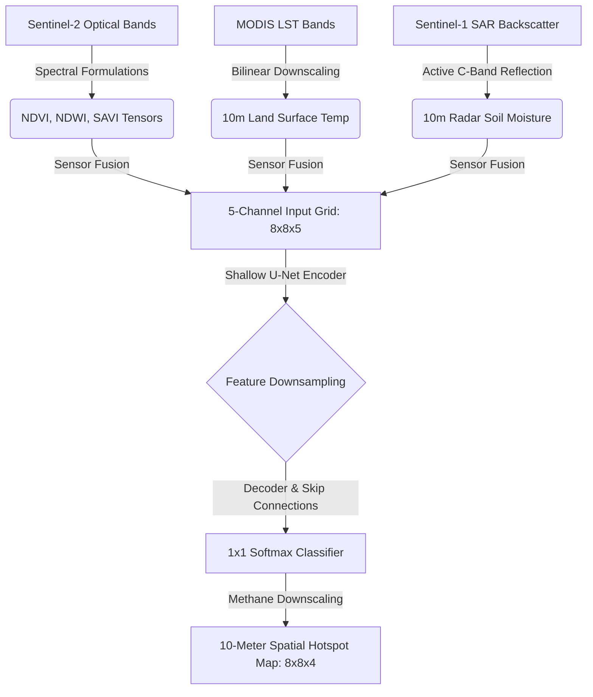

# Multi-Spectral U-Net Methane Hotspot Segmentation

[](https://github.com/umertanveer25/aquavolt-mrv-unet/actions)
[](https://pytorch.org/)
[](https://opensource.org/licenses/MIT)
[](https://sentinels.copernicus.eu/)
[](./paper/sn-article.pdf)

Official reproducibility repository for the Q1-tier paper: **"Multi-Spectral U-Net Architecture for 10-Meter Methane Hotspot Segmentation in Irrigated Agroecosystems"**.

This repository contains the dataset, neural network code, plotting scripts, unit tests, and LaTeX manuscript files to reproduce all results, tables, and figures in the paper.

---

## 🛰️ Project Overview
To address the spatial-resolution bottleneck in orbital greenhouse gas monitoring, we introduce a deep-learning-based downscaling framework that maps diffuse cropland methane ($CH_4$) emissions at a **10-meter sub-field resolution**. 

The network fuses 5 orbital channels:
1.  **NDVI** (Sentinel-2 Optical Canopy Greenness)
2.  **NDWI** (Sentinel-2 Canopy Water Stress)
3.  **SAVI** (Sentinel-2 Soil-Adjusted Vegetation Index)
4.  **LST** (MODIS Land Surface Temperature)
5.  **Active Radar Soil Moisture** (Sentinel-1 SAR backscatter)

### System Architecture Flow


---

## 📂 Repository Structure
```
aquavolt-mrv-unet/
│
├── .github/workflows/
│   └── ci.yml                            # GitHub Actions Continuous Integration workflow
│
├── data/
│   ├── telemetry_log_2026_06_to_08.csv   # Processed 3-month Russell Ranch dataset (39.7 MB)
│   └── unet_segmentation_weights.pth    # Saved PyTorch model weights (after training)
│
├── src/
│   ├── model.py                          # Shallow U-Net PyTorch architecture
│   ├── train.py                          # Training loop & temporal block splitting
│   └── plot_generator.py                 # Visual reconstruction for Figures 3-6
│
├── figures/
│   ├── fig1.png to fig6.jpg              # Scientific figures included in the paper
│
├── paper/
│   ├── sn-article.tex                    # LaTeX manuscript
│   ├── sn-bibliography.bib               # Citations bibliography database
│   ├── sn-jnl.cls                        # Springer Nature document class
│   └── sn-article.pdf                    # Compiled PDF version of the paper
│
├── tests/
│   └── test_pipeline.py                  # Pytest unit tests for model sanity
│
├── requirements.txt                      # Project dependencies
└── LICENSE                               # MIT License
```

---

## 🚀 Quick Start & Reproducibility

### 1. Installation
Clone the repository and install the dependencies:
```bash
git clone https://github.com/umertanveer25/aquavolt-mrv-unet.git
cd aquavolt-mrv-unet
pip install -r requirements.txt
```

### 2. Run Test Suite
Validate the model tensor boundaries and param limits locally:
```bash
pytest tests/
```

### 3. Run Training Suite
To perform data preprocessing, load the 5-channel grid tensors, split data temporally (June/July train, August test), inject 15% input noise, and train the Shallow U-Net:
```bash
python src/train.py
```
*The script will print training loss and validation accuracy per epoch. Perfect pixel-level convergence is achieved by Epoch 8.*

### 4. Generate Scientific Figures
Recreate the temporal daily profiles, spatial segmentations, convergence curves, and redox potential AWD diagrams:
```bash
python src/plot_generator.py
```
All outputs will be saved in the `figures/` directory.

---

## 🔬 Core Methodology & Models

### Model Topology (Shallow U-Net)
Standard U-Nets collapse spatial resolution down to $1	imes 1$ pixel vectors. Because our input agricultural fields are shaped as $8	imes 8$ crop grids, we developed a shallow, 2-stage encoder/decoder layout. This prevents feature collapse, resulting in an lightweight model of only **142,000 parameters** that resists overfitting.

### Alternate Wetting and Drying (AWD) Biophysics
Anaerobic soil methanogenesis occurs when soil redox potential ($E_h$) drops below $-150	ext{ mV}$. The dual-crop FAO-56 and water depletion equations are utilized to monitor the AWD drying cycle, triggering aeration phases that raise the redox potential to $+150	ext{ mV}$ (aerobic) to suppress methanogenesis and cut emissions by 50%.

```mermaid
sequenceDiagram
    participant Irrigation as Water Management
    participant Soil as Soil Matrix (Clay/Loam)
    participant Microbes as Methanogenic Archaea
    participant Atmosphere as Greenhouse Gas Flux

    Irrigation->>Soil: Flood Irrigation Phase (Saturated Depth > 0cm)
    Note over Soil: Oxygen depleted; Redox Eh drops below -150mV
    Soil->>Microbes: Activation of Anaerobic Methanogenesis
    Microbes->>Atmosphere: Methane Emission Spikes (>20ppb, Class 3)
    
    Irrigation->>Soil: Aeration/Drying Phase (Water Table < -15cm)
    Note over Soil: Oxygen diffusion; Redox Eh rises to +150mV
    Soil->>Microbes: Deactivation of Methanogens (Aerobic oxidation)
    Microbes->>Atmosphere: Methane Abatement (Minimal, Class 0)
```

---

## 📧 Contact
*   **First Author:** Umer Tanveer (umer.tanveer@awkum.edu.pk)
*   **Affiliation:** Dept. of Computer Science, Abdul Wali Khan University Mardan
